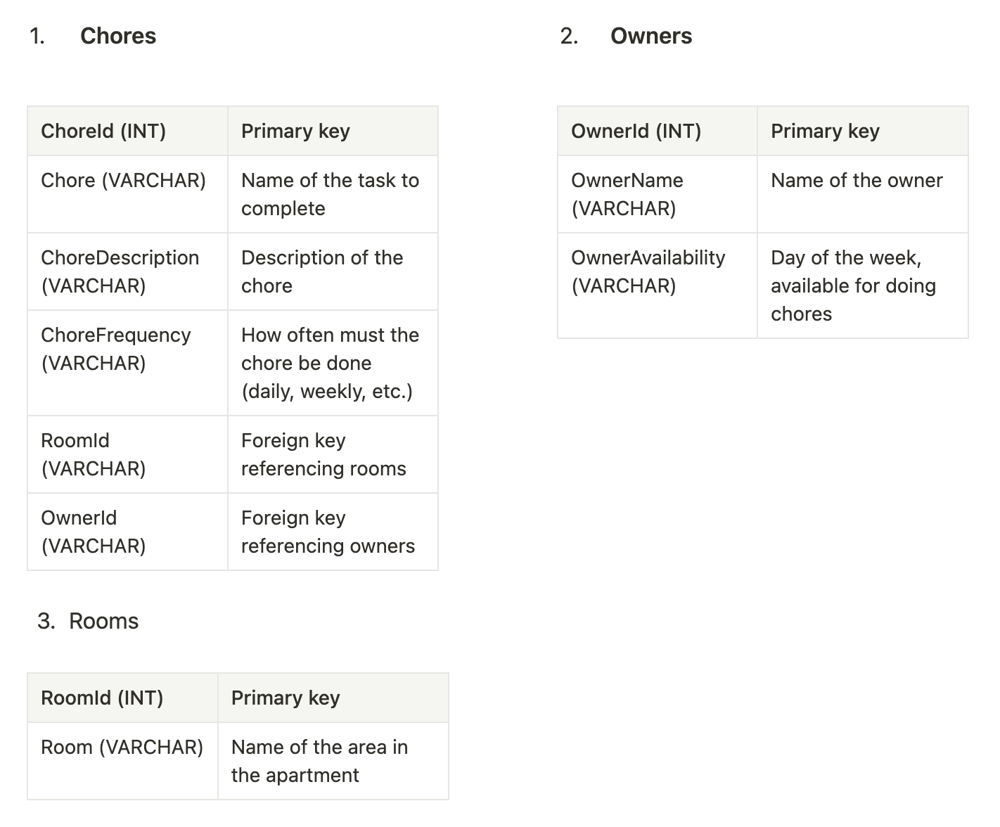

# House Cleaning Pipeline
## Project Idea
Living in a big family requires an efficient cleaning management system. It’s unfair for one person to handle all the chores alone. Therefore, all household members need to participate. Assigning and tracking tasks can be challenging. The Content Management System (CMS) that I have built aims to address this issue.

## Entity Relationship Diagram (ERD)
This ERD illustrates 1-to-Many and Many-to-Many relationships between entities:

### Many-to-Many (M→M) Relationship:
- One chore can have many rooms where they must be completed. 
- One room can have many chores assigned to this specific room.

### One-to-Many (1→M) Relationship:
- Each chore can be assigned to only one Owner. 
- Owner can have many chores.

*The reason for this relationship is that if everyone owns a chore, it is owned by no one.

## Project Setup
1. Clone codebase.
2. Project > ZooApplication Properties > Change target framework to 4.7.1 -> Change back to 4.7.2.
3. Make sure there is an App_Data folder in the project: Right click solution > View in File Explorer > Include in the Project. If it doesn't exist, create App_Data folder by yourself and include it in the project.
4. Run migrations: Tools > Nuget Package Manager > Package Manage Console > Update-Database
5. Check that the database is created using (View > SQL Server Object Explorer > MSSQLLocalDb > ..)

## Features
The Cleaning Pipeline CMS uses ASP.NET, leveraging Entity Framework Code-First Migrations for efficient database management and LINQ for Create, Read, Update and Delete (CRUD) operations. This CMS also includes authentication and authorization features built based on the Individual User Accounts template in an MVC project, allowing secure user login and access control. The logged-in user has the ability to perform Create, Update and Delete operations with all three entities. If the user is not authorized, then the interface allows only to Read information in the CMS.

## Storyboard
Melissa, a mother and housewife, will act as the admin who has a registered account in the CMS. She can easily update chore details, assign each task to a room and a specific family member, and update the information about each family member. As an admin, she also has a right to create and delete from the CMS. 

Melissa has a husband Jack, three children Ann, Mike and Lilly, and two parents living together in one house. Without accounts in the system, each family member will be able to see their assigned chores to ensure they contribute to the cleaning of the house.
